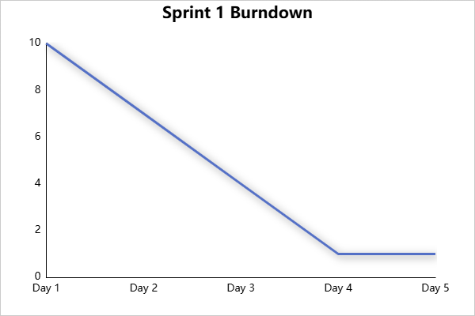

# Agile Final Project – E-commerce Product Catalog Backend

## 📌 Project Overview
This project simulates an Agile sprint using GitHub Projects. As a team of one acting as product owner, scrum master, and developer, I’ve created user stories, managed sprint planning, and simulated a sprint.

## 🔗 Kanban Board
[Final Project Board](https://github.com/sayanB2004/agile-final-project/projects/1)

## ✅ Tasks Completed
- [x] 10 issues created from stakeholder needs
- [x] Used story format “As a… I need… So that…”
- [x] Gherkin syntax for top 5 stories
- [x] Issues labeled (enhancement, technical-debt)
- [x] Milestone created and assigned
- [x] Sprint backlog created
- [x] Sprint executed on board
- [x] Burndown chart created (`burndown.png`)

## 📊 Burndown Chart

